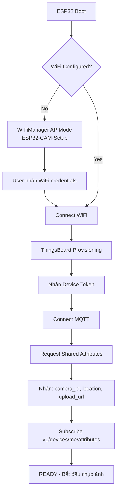

# ESP32-CAM: Zero-Touch Provisioning & Cloud Configuration

## 🎯 Mục Tiêu: "Nạp 1 Firmware → Cắm Điện → Tự Động Hoạt Động"

### Nguyên Tắc Thiết Kế

```
✅ ĐÚNG: 1 FIRMWARE CHO TẤT CẢ CAMERA
   ├─ CHỈ hardcode: provision_key (dùng chung)
   └─ MỌI config khác: NẠP TỪ CLOUD (ThingsBoard)

❌ SAI: Hardcode cấu hình riêng cho từng camera
   ├─ camera_id: KHÔNG hardcode
   ├─ location: KHÔNG hardcode
   ├─ wifi_ssid/password: KHÔNG hardcode
   └─ upload_url: KHÔNG hardcode
```

## 📋 Kiến Trúc Zero-Touch Provisioning

### Quy Trình Khởi Động



### Config Hardcoded (Minimal - CHỈ 1 LẦN)

**`esp32-cam/include/config.h`**:
```cpp
// ⭐ PROVISION KEY - DUY NHẤT HARDCODE
#define PROVISION_DEVICE_KEY    "shared_provision_key"      // Dùng chung cho tất cả camera
#define PROVISION_DEVICE_SECRET "shared_provision_secret"   // Dùng chung cho tất cả camera

// ThingsBoard Server
#define TB_SERVER "tcm-iot.imespro.ai"
#define TB_PORT   1883

// ⚠️ KHÔNG HARDCODE NHỮNG GIÁ TRỊ SAU:
// - camera_id       → Nhận từ shared attributes
// - location        → Nhận từ shared attributes  
// - wifi_ssid       → Lưu bằng WiFiManager
// - wifi_password   → Lưu bằng WiFiManager
// - upload_url      → Nhận từ shared attributes
```

## 🌐 ThingsBoard: Source of Truth cho Config

### 1. Shared Attributes (Server → ESP32)

**Admin thiết lập trên ThingsBoard Dashboard**:

```json
{
  "camera_id": 1,
  "camera_name": "Camera Gò Vấp",
  "location": "Ngã tư Gò Vấp",
  "latitude": 10.8231,
  "longitude": 106.6297,
  "upload_url": "http://103.249.117.212:8000/api/upload",
  "capture_interval": 1000,
  "jpeg_quality": 12,
  "frame_size": 13,
  "fw_version": "1.0.0",
  "fw_url": "http://example.com/firmware.bin"
}
```

**ESP32 nhận attributes khi boot**:
```cpp
void mqtt_request_attributes() {
    // Subscribe topic nhận response
    mqttClient.subscribe("v1/devices/me/attributes/response/+");
    
    // Request tất cả shared attributes
    mqttClient.publish("v1/devices/me/attributes/request/1", "{}");
}

void callback(char* topic, byte* payload, unsigned int length) {
    if (str startsWith("v1/devices/me/attributes")) {
        // Parse JSON
        DynamicJsonDocument doc(1024);
        deserializeJson(doc, payload, length);
        
        // Lưu vào biến toàn cục
        g_camera_id = doc["shared"]["camera_id"];
        g_upload_url = doc["shared"]["upload_url"].as<String>();
        g_location = doc["shared"]["location"].as<String>();
        g_latitude = doc["shared"]["latitude"];
        g_longitude = doc["shared"]["longitude"];
        g_capture_interval = doc["shared"]["capture_interval"];
        
        Serial.println("✅ Config loaded from ThingsBoard");
    }
}
```

**Subscribe để nhận updates real-time**:
```cpp
void setup() {
    // Subscribe để nhận updates khi admin thay đổi
    mqttClient.subscribe("v1/devices/me/attributes");
    mqttClient.setCallback(on_attributes_update);
}

void on_attributes_update(char* topic, byte* payload, unsigned int length) {
    // Admin thay đổi config trên ThingsBoard
    // → ESP32 nhận ngay lập tức
    // → Không cần restart
    
    DynamicJsonDocument doc(512);
    deserializeJson(doc, payload, length);
    
    if (doc.containsKey("capture_interval")) {
        g_capture_interval = doc["capture_interval"];
        Serial.printf("Updated capture_interval: %d\n", g_capture_interval);
    }
    
    if (doc.containsKey("upload_url")) {
        g_upload_url = doc["upload_url"].as<String>();
        Serial.printf("Updated upload_url: %s\n", g_upload_url.c_str());
    }
}
```

### 2. Client Attributes (ESP32 → Server - 1 LẦN KHI BOOT)

**ESP32 publish thông tin hardware**:

```json
{
  "model": "ESP32-CAM AI-Thinker",
  "mac_address": "AA:BB:CC:DD:EE:FF",
  "chip_id": "3C71BF12AB34",
  "sdk_version": "v4.4.2",
  "flash_size": "4MB",
  "psram_size": "4MB"
}
```

**Code**:
```cpp
void publish_client_attributes() {
    DynamicJsonDocument doc(512);
    
    doc["model"] = "ESP32-CAM AI-Thinker";
    doc["mac_address"] = WiFi.macAddress();
    doc["chip_id"] = String((uint32_t)ESP.getEfuseMac(), HEX);
    doc["sdk_version"] = ESP.getSdkVersion();
    doc["flash_size"] = String(ESP.getFlashChipSize() / 1024 / 1024) + "MB";
    doc["psram_size"] = String(ESP.getPsramSize() / 1024 / 1024) + "MB";
    
    String output;
    serializeJson(doc, output);
    
    mqttClient.publish("v1/devices/me/attributes", output.c_str());
}
```

### 3. Telemetry (ESP32 → Server - REAL-TIME)

**Telemetry định kỳ (mỗi lần upload ảnh)**:

```json
{
  "free_heap": 125000,
  "wifi_rssi": -65,
  "upload_ok": true,
  "last_http_code": 200,
  "latency_ms": 450,
  "img_size_kb": 180,
  "upload_fail_count": 0,
  "last_error": null
}
```

**Code**:
```cpp
void publish_telemetry(bool upload_success, int http_code, int latency, int img_size) {
    DynamicJsonDocument doc(512);
    
    doc["free_heap"] = ESP.getFreeHeap();
    doc["wifi_rssi"] = WiFi.RSSI();
    doc["upload_ok"] = upload_success;
    doc["last_http_code"] = http_code;
    doc["latency_ms"] = latency;
    doc["img_size_kb"] = img_size;
    doc["upload_fail_count"] = g_fail_count;
    doc["last_error"] = g_last_error;
    
    String output;
    serializeJson(doc, output);
    
    mqttClient.publish("v1/devices/me/telemetry", output.c_str());
}
```

## 🔧 Admin Workflow

### Bước 1: Nạp Firmware (1 LẦN DUY NHẤT)

```bash
cd esp32-cam
pio run -t upload
```

**Firmware chứa**:
- ✅ `PROVISION_DEVICE_KEY` (shared)
- ✅ `TB_SERVER` address
- ❌ KHÔNG chứa: camera_id, location, wifi, upload_url

### Bước 2: Cắm Điện Lần Đầu

1. ESP32 tạo WiFi AP: **ESP32-CAM-Setup**
2. Connect vào AP, truy cập `http://192.168.4.1`
3. Nhậ WiFi credentials → ESP32 tự động kết nối

### Bước 3: Provision Tự Động

ESP32 gửi request lên ThingsBoard:
```json
POST /api/v1/provision
{
  "deviceName": "ESP32-CAM-3C71BF12AB34",
  "provisionDeviceKey": "shared_provision_key",
  "provisionDeviceSecret": "shared_provision_secret"
}
```

ThingsBoard response:
```json
{
  "status": "SUCCESS",
  "credentialsType": "ACCESS_TOKEN",
  "credentialsValue": "AbCdEf1234567890"
}
```

ESP32 lưu token vào EEPROM/NVS → Không cần provision lại.

### Bước 4: Admin Cấu Hình trên ThingsBoard

1. Vào **Devices** → Tìm device mới provision
2. Click **"Configure"**:
   - Nhập `camera_id`: `1`
   - Nhập `location`: `"Ngã tư Gò Vấp"`
   - Nhập `latitude`: `10.8231`
   - Nhập `longitude`: `106.6297`
   - Nhập `upload_url`: `"http://103.249.117.212:8000/api/upload"`
3. Click **"Activate"**

→ ESP32 nhận shared attributes ngay lập tức → BẮT ĐẦU HOẠT ĐỘNG!

### Bước 5: Monitor Real-Time

Trên ThingsBoard Dashboard:
- Xem telemetry: free_heap, wifi_rssi, upload_ok
- Xem latest values
- Tạo alarm nếu device offline

## 🔄 Update Config Không Cần Nạp Lại Firmware

### Thay Đổi Upload URL

```
Admin → ThingsBoard Dashboard → Edit Shared Attributes
    └─ upload_url: "http://NEW_IP:8000/api/upload"
         └─ ESP32 nhận ngay qua MQTT subscription
              └─ Áp dụng luôn, KHÔNG cần restart
```

### Thay Đổi Capture Interval

```
Admin → ThingsBoard
    └─ capture_interval: 500 (chụp 2 ảnh/giây)
         └─ ESP32 cập nhật ngay
```

### Thay Đổi Location

```
Admin → ThingsBoard
    └─ location: "Ngã tư Phạm Văn Đồng"
    └─ latitude: 10.1234
    └─ longitude: 106.5678
         └─ ESP32 sẽ gửi location mới trong metadata
```

## 🚀 OTA Firmware Update

**Admin upload firmware mới**:

1. Build firmware mới:
   ```bash
   pio run
   # firmware.bin ở .pio/build/esp32cam/firmware.bin
   ```

2. Upload lên web server:
   ```bash
   scp firmware.bin user@your-server:/var/www/html/firmware/v1.0.1.bin
   ```

3. Cập nhật shared attributes:
   ```json
   {
     "fw_version": "1.0.1",
     "fw_url": "http://your-server/firmware/v1.0.1.bin"
   }
   ```

4. ESP32 tự động:
   - Nhận attributes update
   - So sánh version (1.0.0 → 1.0.1)
   - Download firmware mới
   - Flash
   - Restart

**Code OTA xử lý**:
```cpp
void ota_handle_attributes(const char* fw_version, const char* fw_url) {
    const esp_app_desc_t* app_desc = esp_ota_get_app_description();
    
    if (strcmp(app_desc->version, fw_version) != 0) {
        Serial.printf("[OTA] New version: %s\n", fw_version);
        ota_perform_update(fw_url);
    }
}
```

## 📊 Camera ID Generation

**Option 1: Auto-generate từ MAC address**
```cpp
uint64_t chipid = ESP.getEfuseMac();
int camera_id = (int)(chipid & 0xFFFF);  // Sử dụng 16 bit cuối
```

**Option 2: Admin assign manually trên ThingsBoard**
- Device provision → Admin vào ThingsBoard → Set `camera_id` trong shared attributes

**Recommended: Option 2** - Dễ quản lý, tránh conflict.

## 🎯 Summary: Quy Trình Hoàn Chỉnh

### ① Lần Đầu Setup

```
Developer:
  └─ Nạp firmware (1 lần) với provision_key

User:
  └─ Cắm điện
      └─ Kết nối WiFi AP
          └─ Nhập WiFi credentials

Admin:
  └─ ThingsBoard → Cấu hình shared attributes:
      ├─ camera_id: 1
      ├─ location: "Ngã tư Gò Vấp"  
      ├─ latitude: 10.8231
      ├─ longitude: 106.6297
      └─ upload_url: "http://..."
           └─ ESP32 → READY!
```

### ② Update Config (Bất Cứ Lúc Nào)

```
Admin → ThingsBoard → Edit Attributes
    └─ ESP32 nhận realtime qua MQTT
        └─ Áp dụng ngay, KHÔNG restart
```

### ③ OTA Update

```
Admin → Upload firmware.bin → ThingsBoard
    └─ ESP32 tự download & flash
        └─ Restart với firmware mới
```

## ✅ Checklist: Zero-Touch Provisioning

- [x] Chỉ hardcode `provision_key` trong firmware
- [x] WiFi credentials lưu bằng WiFiManager
- [x] ThingsBoard auto-provisioning
- [x] Request shared attributes mỗi khi boot
- [x] Subscribe `v1/devices/me/attributes` để nhận updates
- [x] Publish client attributes (1 lần khi boot)
- [x] Publish telemetry real-time
- [x] OTA update từ shared attributes
- [x] Không cần nạp lại firmware để đổi config

---

**KẾT LUẬN**: 
- ✅ 1 firmware cho TẤT CẢ camera
- ✅ Admin chỉ cần: Cắm điện → Nhập WiFi → Config trên ThingsBoard
- ✅ KHÔNG BAO GIỜ phải nạp lại firmware để đổi config
