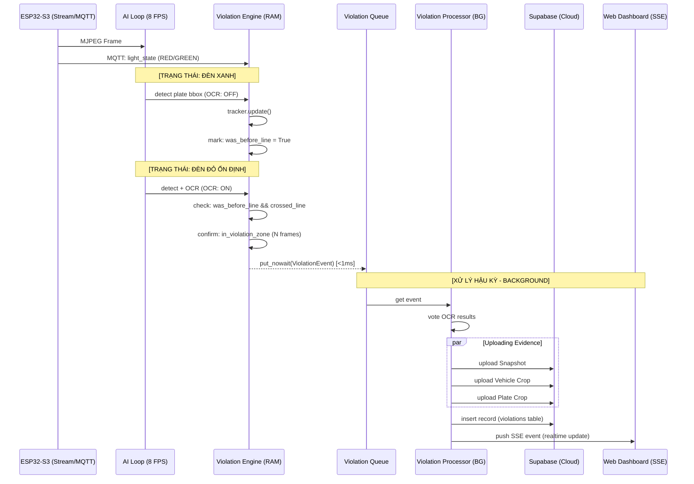

# Tài liệu Luồng Xử Lý Vi phạm (Vi phạm Vượt Đèn Đỏ)
## Kiến trúc Tối ưu hóa - Backend State Machine



Hệ thống được thiết kế để hoạt động ổn định trên môi trường Windows với cơ chế xử lý song song, tách biệt giữa tầng nhận dạng thời gian thực (AI Loop) và tầng xử lý dữ liệu nặng (Violation Processor).

---

## 1. Tổng quan Luồng Dữ liệu
Hệ thống chia làm 3 tầng xử lý chính để đảm bảo không bị lag (blocking):

1.  **AI Loop (8 FPS):** Nhận frame, chạy model plate detection, tracking. Luôn chạy để giữ context.
2.  **Violation Engine:** State machine kiểm tra điều kiện vi phạm dựa trên logic vạch dừng (Stop Line) và vùng vi phạm (Violation Zone).
3.  **Violation Processor (Background):** Xử lý I/O nặng (OCR, Upload ảnh, Save DB, Push SSE) sau khi vi phạm đã được chốt.

---

## 2. Chi tiết State Machine theo Màu Đèn

### Giai đoạn Đèn XANH (Monitoring)
*   **AI Goal:** Chỉ cần biết xe nào đang ở đâu.
*   **Action:** 
    *   Chạy `plate detection` lấy Bbox (Tắt OCR - `ocr_enabled=False` để cực nhẹ).
    *   Cập nhật `Plate Tracker` (Không bao giờ reset tracker khi đèn xanh).
    *   **Mark `was_before_line = True`:** Nếu biển số xuất hiện phía trước vạch dừng khi đèn đang xanh. Đây là điều kiện tiên quyết để phạt sau này.

### Giai đoạn Đèn ĐỎ (Violation Detection)
*   **AI Goal:** Xác định hành vi vượt vạch và chốt bằng chứng.
*   **Action:**
    *   Bật full pipeline AI (Detect + OCR).
    *   **Check Crossing:** Nếu xe có `was_before_line = True` và tọa độ hiện tại cắt qua `Stop Line` sau khi đèn đỏ đã ổn định (`is_red_stable`).
    *   **Zone Confirm:** Sau khi cắt vạch, xe phải tiếp tục xuất hiện trong `Violation Zone` đủ $N$ frame liên tiếp để loại bỏ nhiễu.
    *   **Enqueue Event:** Khi đủ điều kiện, Engine đẩy một `ViolationEvent` siêu nhẹ vào Queue (`put_nowait`). Thời gian xử lý tại AI Loop lúc này là $< 1ms$.

---

## 3. Background Processing (Violation Processor)
Việc xử lý này diễn ra song song, không làm chậm nhịp AI:

1.  **OCR Voting:** Tổng hợp kết quả OCR từ nhiều frame trong lịch sử track để chọn ra biển số chính xác nhất.
2.  **Parallel Upload:** Upload 3 loại ảnh bằng chứng lên Supabase Storage cùng lúc:
    *   `Snapshot`: Ảnh toàn cảnh lúc cắt vạch.
    *   `Vehicle Crop`: Ảnh zoom xe vi phạm.
    *   `Plate Crop`: Ảnh biển số rõ nhất.
3.  **DB Persistence:** Lưu bản ghi vi phạm vào bảng `violations` trong Supabase.
4.  **Realtime Push:** Gửi sự kiện qua SSE/Websocket để Dashboard cập nhật thẻ vi phạm ngay lập tức.

---

## 4. Tóm tắt Logic Chốt Phạt
Một xe chỉ bị coi là vi phạm khi hội đủ:
1.  **Xuất hiện trước vạch** khi đèn còn xanh hoặc chưa đỏ ổn định.
2.  **Cắt qua vạch** khi đèn đã đỏ ổn định.
3.  **Đi sâu vào vùng vi phạm** và được AI xác nhận qua nhiều khung hình.

> [!TIP]
> Việc tách tầng Processor giúp Backend xử lý được nhiều camera cùng lúc mà không bị nghẽn AI loop khi có nhiều xe vi phạm đồng thời.

---

## 5. Quy trình kỹ thuật (Pseudo-code)
```python
# Luồng chuẩn Backend
if light == GREEN:
    detect_bbox_only()
    mark_was_before_line()
    
elif light == RED_STABLE:
    if was_before_line and crossed_stop_line:
        if confirm_in_zone(N_frames):
            push_to_background_queue(ViolationEvent)

# Background Task
while True:
    event = queue.get()
    vote_ocr_text()
    upload_images_async()
    save_to_supabase()
    push_realtime_web()
```